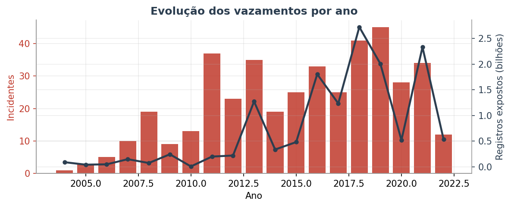
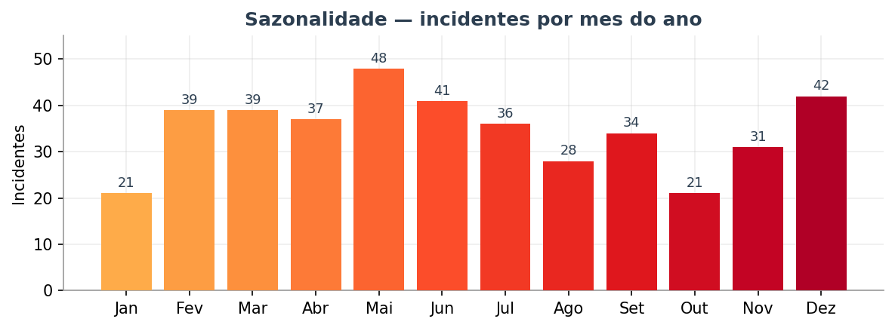
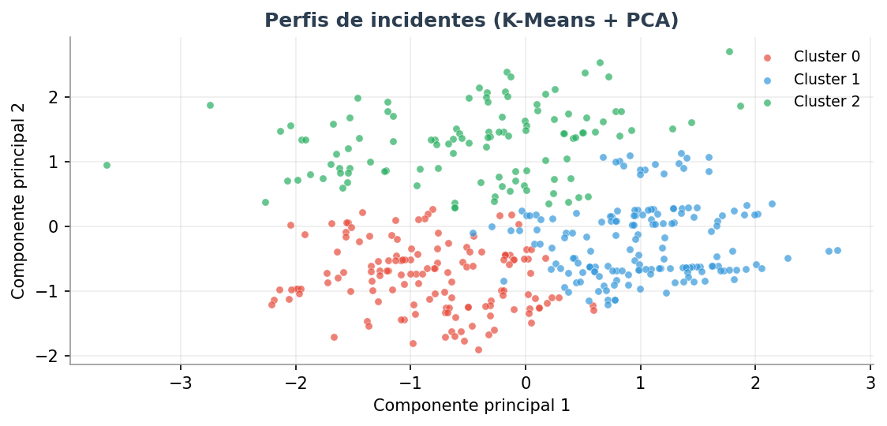
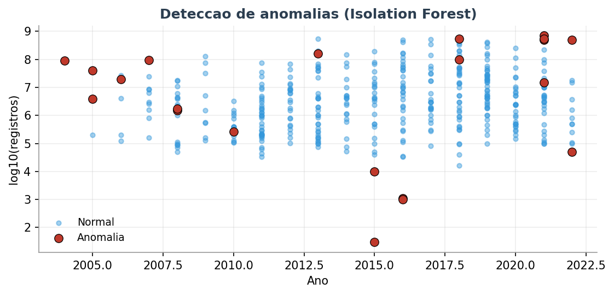

# 🛡️ Maiores Vazamentos de Dados do Mundo — Análise de Dados ponta a ponta

Análise exploratória, **Machine Learning** e *storytelling* sobre os maiores vazamentos de dados já documentados (2004–2022): **417 incidentes** e mais de **14,3 bilhões de registros expostos**.

Projeto completo, do dado bruto ao relatório executivo — pensado como peça de portfólio em Ciência/Análise de Dados.


---

## 📌 Sobre o projeto

A partir da base *"World's Biggest Data Breaches & Hacks"*, o projeto percorre quatro níveis de profundidade:

| Nível | Entrega |
|-------|---------|
| **1 · Enriquecimento** | Sazonalidade, volume de registros por método e ranking de entidades reincidentes |
| **2 · Dashboard** | 10 gráficos interativos reunidos em um único HTML offline |
| **3 · Machine Learning** | Classificação, *clustering* (K-Means) e detecção de anomalias (Isolation Forest) |
| **4 · Storytelling** | Relatório executivo em PDF com narrativa, insights e recomendações |

---

## 🔍 Principais insights

- 🔓 **Invasão direta ("Hacked") domina:** 66% de todos os incidentes e 9,27 bilhões de registros expostos — mas boa parte das exposições vem de falhas **evitáveis** (má configuração de nuvem, dispositivos perdidos).
- 📅 **Há sazonalidade:** **maio** concentra o maior número de incidentes — útil para planejar auditorias e conscientização.
- 🔁 **Reincidência é regra:** 18 organizações foram atacadas mais de uma vez; a líder acumula 5 incidentes.
- 🤖 **O modelo que mais ensinou "falhou":** prever o método de ataque a partir de setor, ano e tamanho ficou *abaixo* do baseline — provando que **esses atributos não determinam o vetor de ataque**. Honestidade analítica > métrica inflada.
- 🚨 **21 vazamentos atípicos** sinalizados automaticamente, incluindo megacasos como LinkedIn (700M) e Shanghai Police (500M).

---

## 📊 Algumas visualizações

**Evolução por ano — frequência (barras) × volume exposto (linha)**


**Sazonalidade — incidentes por mês**


**Perfis de incidente (K-Means + PCA)**


**Detecção de anomalias (Isolation Forest)**


> 💡 Para a versão **interativa**, abra [`outputs/dashboard.html`](outputs/dashboard.html) no navegador (arquivo único, funciona offline).
> 📄 Relatório completo: [`outputs/Relatorio_Vazamentos_de_Dados.pdf`](outputs/Relatorio_Vazamentos_de_Dados.pdf)

---

## 🗂️ Estrutura do projeto

```
.
├── 01_eda_breaches.py            # Limpeza + EDA (8 gráficos base)
├── 02_nivel1_enriquecimento.py   # Nível 1: sazonalidade, método, reincidência
├── 03_dashboard.py               # Nível 2: dashboard unificado (HTML offline)
├── 04_machine_learning.py        # Nível 3: classificação, clustering, anomalias
├── 05_relatorio_pdf.py           # Nível 4: relatório executivo em PDF
├── data/
│   ├── raw/                      # Base original
│   └── processed/                # Dados limpos + tabelas intermediárias
├── outputs/
│   ├── dashboard.html            # Dashboard interativo (arquivo único)
│   ├── Relatorio_Vazamentos_de_Dados.pdf
│   └── report_images/            # Imagens usadas no relatório/README
├── requirements.txt
└── README.md
```

---

## 🚀 Como executar

```bash
# 1. Instalar dependências
pip install -r requirements.txt

# 2. Rodar o pipeline na ordem
python 01_eda_breaches.py          # limpeza + gráficos base
python 02_nivel1_enriquecimento.py # análises do Nível 1
python 03_dashboard.py             # dashboard unificado
python 04_machine_learning.py      # modelos de ML
python 05_relatorio_pdf.py         # relatório em PDF
```

Os artefatos são gerados em `outputs/`.

---

## 🛠️ Stack

**Python** · **Pandas** / **NumPy** (manipulação) · **Plotly** / **Matplotlib** / **Seaborn** (visualização) · **scikit-learn** (Random Forest, K-Means, Isolation Forest) · **ReportLab** (geração de PDF).

---

## 📚 Fonte dos dados

Base *"World's Biggest Data Breaches & Hacks"* (Information is Beautiful). Uso educacional e de portfólio.

---

## 👤 Autora

Desenvolvido por **Nathalia Fukuda** · [github.com/nathfukuda](https://github.com/nathfukuda)
Sinta-se à vontade para abrir uma *issue* ou se conectar para trocar ideias sobre dados e segurança.

---

<sub>Projeto de portfólio · análise de dados ponta a ponta · 2026</sub>
